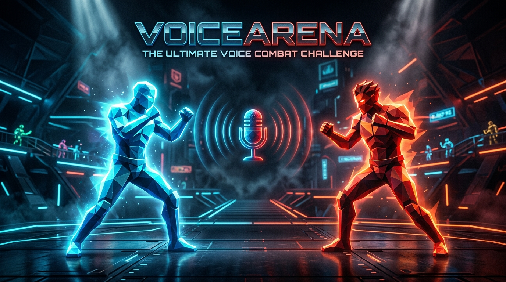
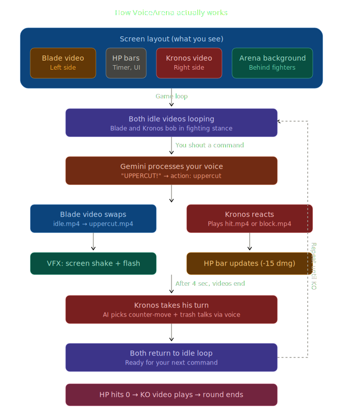

# 🥊 VoiceArena

> **Command your fighter with your voice.**
> The world's first voice-controlled fighting game powered by AI.



[](https://geminiliveagentchallenge.devpost.com/)
[](LICENSE)
[](https://cloud.google.com/run)

---

## 🎮 What is VoiceArena?

VoiceArena is a browser-based fighting game where **your voice is the controller**. Shout "Punch!", "Uppercut!", "Dodge left!" and watch your fighter execute in real-time.

Your opponent — **KRONOS** — is an AI fighter powered by Gemini Live API who fights back, trash-talks you, adapts to your fighting style, and can be interrupted mid-sentence.

No buttons. No keyboard. Just your voice vs AI.

**Key features:**
- Voice-controlled combat with 10+ commands processed in real-time
- AI opponent with personality — trash-talks, adapts, changes tone based on who's winning
- Barge-in mechanic — interrupt Kronos mid-taunt for a surprise attack with bonus damage
- Cinematic AI-generated fighter animations powered by Google Veo
- Adaptive AI — spam the same move and Kronos learns to counter it
- Best-of-3 rounds with health bars, timers, and KO sequences

---

## 🏗️ Architecture

```
Browser (Frontend)                    Cloud Run (Backend)
┌─────────────────────┐              ┌──────────────────────────┐
│  Video Player       │◄── wss:// ──►│  FastAPI + WebSocket     │
│  (fight clips)      │              │                          │
│                     │              │  ┌──────┐  ┌───────────┐ │
│  Audio Capture      │              │  │ Game │  │  Kronos   │ │
│  (mic → Gemini)     │              │  │Engine│  │  Agent    │ │
│                     │              │  └──────┘  │  (ADK)    │ │
│  Game UI            │              │            └─────┬─────┘ │
│  (HP, timer, VFX)   │              │                  │       │
└─────────────────────┘              │  ┌───────────────┴─────┐ │
                                     │  │ Gemini Live API     │ │
        ┌────────────┐               │  │ (native audio I/O)  │ │
        │ Cloud      │               │  └─────────────────────┘ │
        │ Storage    │               └──────────┬───────────────┘
        │ (videos,   │                          │
        │  SFX)      │               ┌──────────┴──────────┐
        └────────────┘               │     Firestore       │
                                     │   (leaderboard)     │
                                     └─────────────────────┘
```

---

## 🛠️ Tech Stack

| Layer | Technology |
|:--|:--|
| **Frontend** | HTML5 Video, Vanilla JS, CSS |
| **Backend** | Python, FastAPI, WebSockets |
| **AI Voice** | Gemini Live API (native audio) |
| **Agent** | Google ADK |
| **Fighter Assets** | Google Veo 3 + Imagen (via Flow) |
| **Hosting** | Google Cloud Run |
| **Database** | Google Firestore |
| **Static Assets** | Google Cloud Storage |

---

## 🔄 Game Flow



---

## 🎯 How to Play

1. Open VoiceArena in your browser
2. Allow microphone access
3. Click **START FIGHT**
4. Shout commands at your fighter:

| Command | Action | Damage |
|:--|:--|:--|
| "Punch" / "Jab" | Quick straight punch | 5 |
| "Hook" | Wide hook punch | 10 |
| "Uppercut" | Rising uppercut | 15 |
| "Kick" | Mid roundhouse kick | 10 |
| "Roundhouse" | Spinning head kick | 15 |
| "Block" | Raise guard | — |
| "Dodge left / right" | Sidestep | — |
| "Duck" | Crouch under high attacks | — |
| "Counter" | Parry + quick strike | 12 |
| "Taunt" | Builds special meter | — |
| "Special" | Ultimate move (needs full meter) | 25 |

> **Pro tip:** Interrupt Kronos while he's trash-talking to land a surprise hit for bonus damage!

---

## 🤖 Meet KRONOS

Kronos is your AI opponent. He's not just a bot — he has personality.

| State | Behavior |
|:--|:--|
| **Winning** | Cocky trash-talk — *"Is that all you got? My grandmother hits harder."* |
| **Losing** | Desperate — *"Lucky shots! You can't keep this up!"* |
| **Adapting** | Detects patterns — spam punches and he starts blocking |
| **Taunting** | Can be interrupted — barge-in for bonus damage |

Kronos's voice, personality, and fight logic are all powered by Gemini Live API's native audio with affective dialogue.

---

## 🚀 Quick Start

### Prerequisites

- Python 3.11+
- Google Cloud account with billing enabled
- Gemini API access (Vertex AI)
- `gcloud` CLI installed and authenticated

### Setup

```bash
# Clone
git clone https://github.com/ritwikareddykancharla/voicearena.git
cd voicearena

# Backend
cd backend
python -m venv venv
source venv/bin/activate        # Windows: venv\Scripts\activate
pip install -r requirements.txt

# Configure GCP
gcloud auth application-default login
gcloud config set project YOUR_PROJECT_ID
gcloud services enable \
  aiplatform.googleapis.com \
  run.googleapis.com \
  firestore.googleapis.com \
  storage.googleapis.com

# Environment
export GOOGLE_CLOUD_PROJECT=your-project-id
export GOOGLE_CLOUD_LOCATION=us-central1

# Run
uvicorn backend.main:app --reload --port 8080
```

Open **http://localhost:8080** in Chrome (mic access required).

### Deploy to Cloud Run

```bash
gcloud run deploy voicearena \
  --source . \
  --region us-central1 \
  --allow-unauthenticated \
  --set-env-vars GOOGLE_CLOUD_PROJECT=your-project-id
```

---

## 📂 Project Structure

```
voicearena/
├── README.md
├── Dockerfile
├── backend/
│   ├── main.py                 # FastAPI + WebSocket server
│   ├── game_engine.py          # HP, rounds, damage calc
│   ├── kronos_agent.py         # ADK agent for Kronos
│   ├── voice_handler.py        # Gemini Live API session
│   ├── command_parser.py       # Voice → action mapping
│   └── requirements.txt
├── frontend/
│   ├── index.html              # Game page
│   ├── js/
│   │   ├── main.js             # Game initialization
│   │   ├── video-manager.js    # Fighter video swapping
│   │   ├── game-state.js       # Frontend state manager
│   │   ├── websocket.js        # WebSocket client
│   │   ├── audio.js            # Mic capture + AI playback
│   │   ├── ui.js               # HP bars, timer, round UI
│   │   └── vfx.js              # Screen shake, flash, particles
│   ├── css/style.css
│   └── assets/
│       ├── videos/             # Veo3 fighter clips (.mp4)
│       ├── sounds/             # SFX (punch, crowd, KO)
│       └── ui/                 # UI elements
├── deploy/
│   └── cloudbuild.yaml         # Automated deployment
└── docs/
    ├── architecture.svg
    ├── 01-GAME-DESIGN.md
    ├── 02-ARCHITECTURE.md
    └── 03-BUILD-GUIDE.md
```

---

## ☁️ Google Cloud Services

| Service | Usage |
|:--|:--|
| **Gemini Live API** | Real-time bidirectional voice — player commands in, Kronos voice out |
| **ADK** | Agent orchestration for Kronos — pattern detection, strategy, personality |
| **Cloud Run** | Hosts the FastAPI backend with WebSocket support |
| **Firestore** | Match history, leaderboards, player stats |
| **Cloud Storage** | Serves video assets and sound files |
| **Veo 3 / Imagen** | AI-generated fighter animations and arena visuals |

---

## 🔑 Gemini Live API Features Showcased

| Feature | How it's used |
|:--|:--|
| **Native Audio** | No STT/TTS pipeline — raw audio in, natural voice out, sub-second latency |
| **Barge-In** | Player interrupts Kronos mid-taunt — core game mechanic |
| **Affective Dialogue** | Kronos's emotional tone adapts to fight context |
| **Tool Use** | Kronos uses ADK tools to query game state and execute moves |

---

## 📹 Demo Video

[](https://youtube.com/watch?v=YOUR_VIDEO_ID)

---

## 📄 License

VoiceArena — Voice-controlled fighting game
Copyright (C) 2026 Ritwika Reddy Kancharla

Licensed under AGPL-3.0 — see [LICENSE](LICENSE) for details.

---

## 🙏 Acknowledgments

Built with [Google Gemini Live API](https://ai.google.dev/gemini-api/docs/live-api) and [ADK](https://google.github.io/adk-docs/) •
Fighter animations generated with [Google Veo](https://deepmind.google/models/veo/) •
Sound effects from [Freesound](https://freesound.org/) and [Mixkit](https://mixkit.co/)

---

<p align="center"><b>Built for the Gemini Live Agent Challenge 2026</b> 🏆</p>
